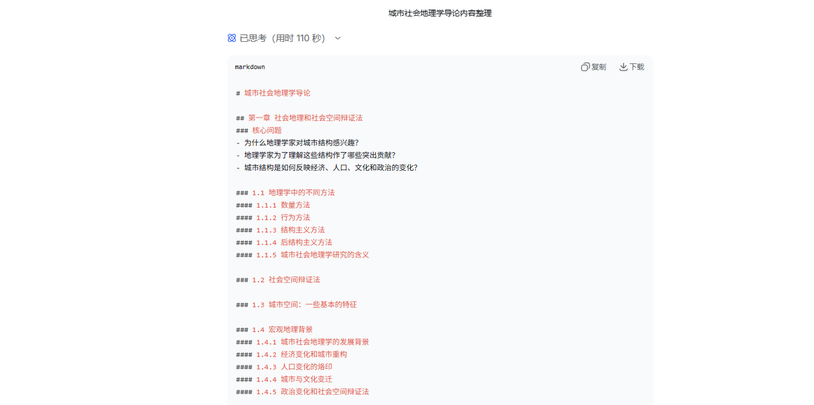
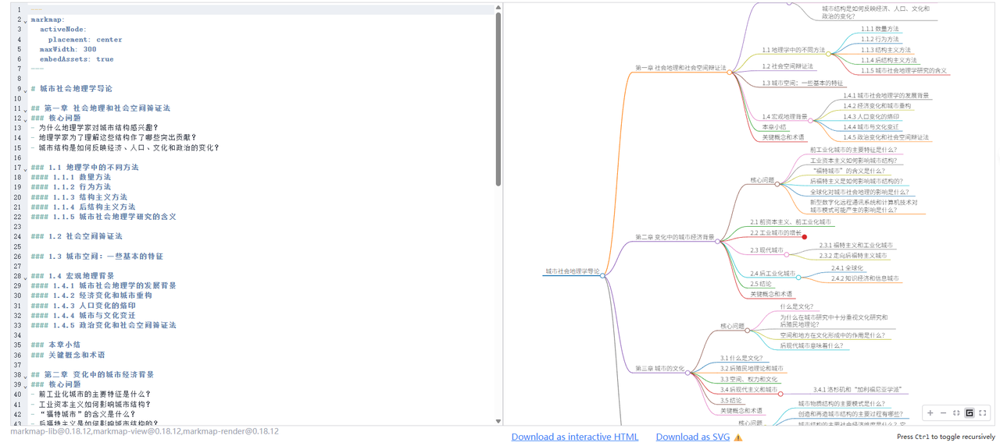
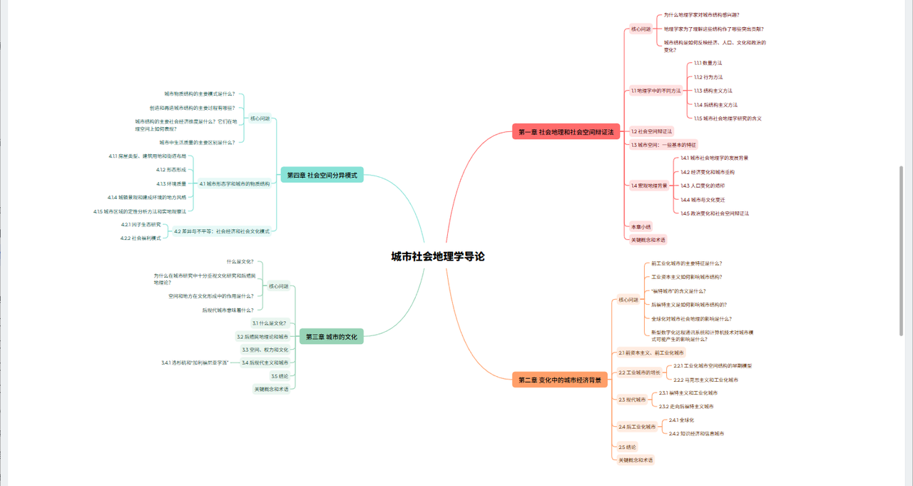

今天分享两种用 AI 帮你做思维导图的思路。

不管你是想“一键偷懒”，还是想“深度整理”，这篇教程都能救你！

下面我们直接开始！

***

### 一 、懒人方案：AI脑图工具

如果你手头已经有现成的 PDF、Word 等资料，诉求是“快点让我看到大概结构”，那这个方案最适合你。

现在很多工具都支持“文档一键转脑图”。

你只需要把文件拖进去，AI 就会自动分析这一大堆文字，帮你拆解出层级。

试了市面上很多工具，比较推荐这几个：

* **Mapify (原 ChatMind)**：专攻 AI 脑图，对长文本的总结能力很强，适合处理电子书。

* **GitMind (思乎)**：国产软件，中文理解力很棒，生成的图还能继续让 AI 帮你修改。

* **WPS AI / XMind AI**：如果你本来就在用这些软件办公，直接点一下里面的“AI 生成”按钮就行，学习成本几乎为零。

* Notebooklm：为处理海量信息而生的神器，可以说是“你的第二大脑 ”。

具体使用可以看之前这篇：

[NotebookLM国内如何使用？93%的人还不知道的谷歌免费工具](https://toolmanai.com/posts/notebooklm-jiaocheng/)

***

### 二、进阶方案：大模型 + Markdown

这其实是我最想推荐给各**“认真学习党”**方法。

为什么？

因为前面的“傻瓜式生成”，逻辑有时候很难控制。

而这个方法，能让你利用 GPT / Kimi / DeepSeek 等强大的逻辑能力，生成极其精准的结构，

也就是我们常说**“X-Y 问题”**的最优解。

**原理非常简单，就是一个公式：**

> 你的资料 + AI 整理指令 = Markdown 代码 -> 漂亮脑图

别听到“代码”就害怕，这完全不需要你会编程！

跟着我做，三步搞定。

#### 第 1 步：让 AI 帮你整理数据

随便打开一个你常用的 AI 助手（比如DeepSeek），把你的资料扔进去。

一并发送下面这段提示词，可以按实际调整：

> \# 角色设定
>
> 你是一位大学城市规划专业的博士生导师。
>
>
>
> \# 任务
>
> 你正在给一位成绩极烂的学生讲《城市社会地理学导论》，请阅读我发送的资料，将其整理为适合转换成思维导图的 Markdown 格式。
>
>
>
> \# 要求
>
> \- 层级明确：使用 # 表示一级标题，## 表示二级，以此类推。
>
> \- 逻辑清晰：按时间顺序或因果逻辑排列。
>
> \- 格式纯净：直接输出代码块，不要废话。

发送后，AI 会给到一串带 `#` 号的文字，那就是我们要的“原材料”。

#### 第 2 步：一键渲染成图

拿到那串文字后，复制。然后我们需要一个“渲染器”把它变成图。

这里推荐两个神器：

**神器 A：Markmap (最快)**

* 打开`https://markmap.js.org/repl`，把刚才复制的文字粘贴到左边框里。

* 然后瞬间你就会得到一张可缩放、可交互的彩色思维导图，下载就行。

**神器 B：XMind (最通用)**

* 将 AI 生成的markdown文件下载下来（或者是新建txt，复制粘贴保存）。

* 直接在 XMind 软件里选择`“文件 -> 导入 -> Markdown”`，你就能得到一张完整脑图啦！

这样生成的图，你后续还可以随意调整颜色、加图标，非常方便复习。

***

### 三、避坑指南

虽然 AI 很强，但在处理资料时，有两点要特别注意：

#### **1.警惕“逻辑幻觉”**

AI 有时候会一本正经地胡说八道，生成后，记得花 5 分钟扫一眼大标题，确认核心逻辑没硬伤。

#### **2.让AI详略结合**

在写提示词时，可以特意要求 AI 重点展示你关注的部分，这样生成的导图才更有价值。

好啦，今天的分享就到这里！

不管是哪种方法，都能让你整理资料的时间大大缩短。

然后把省下来的时间用来深度思考和记忆，这才是 AI 时代的学习方式。

