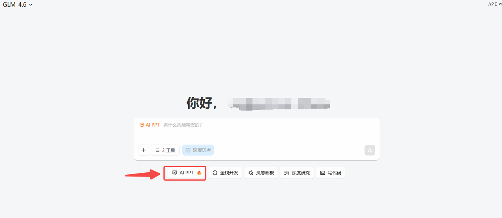
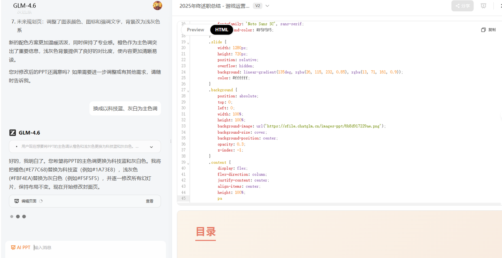
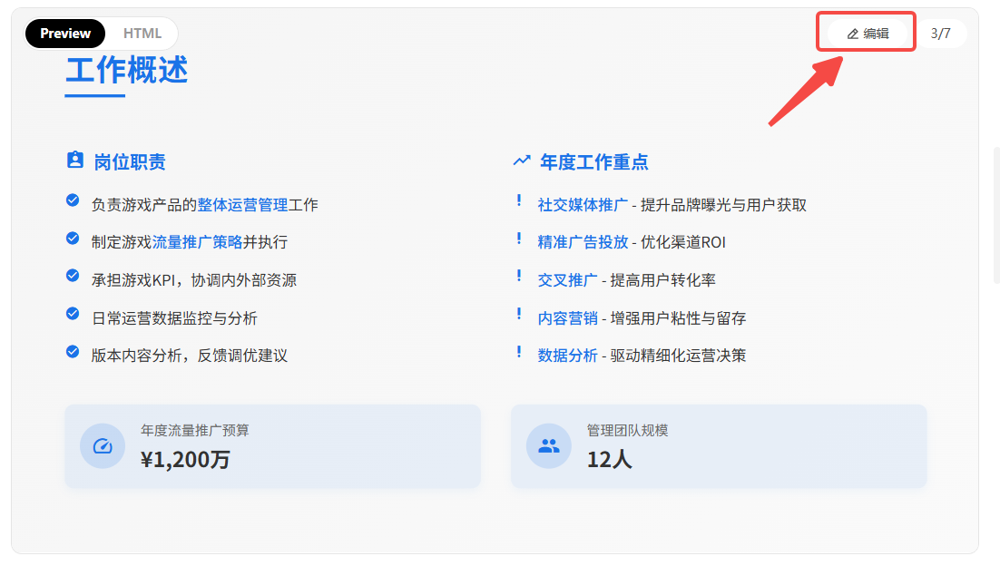
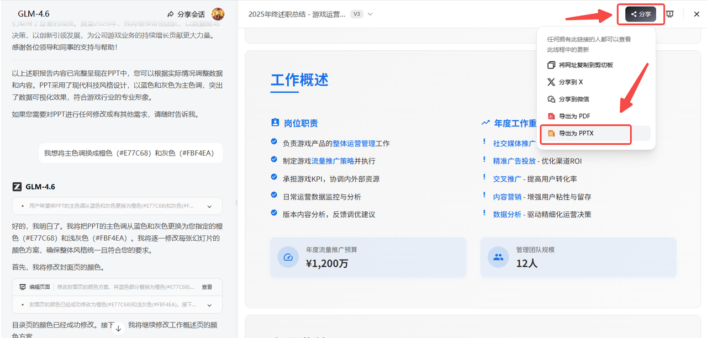
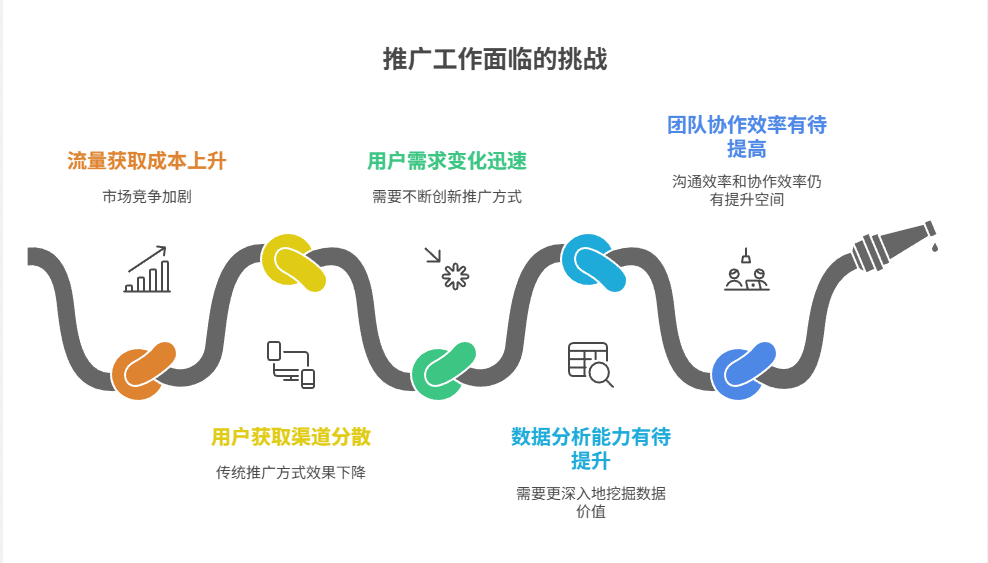
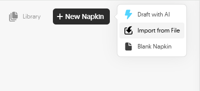
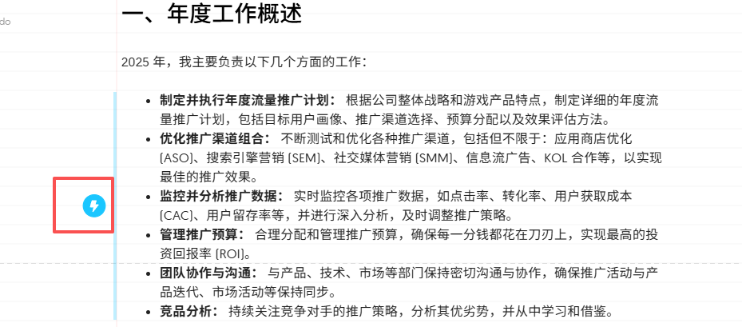
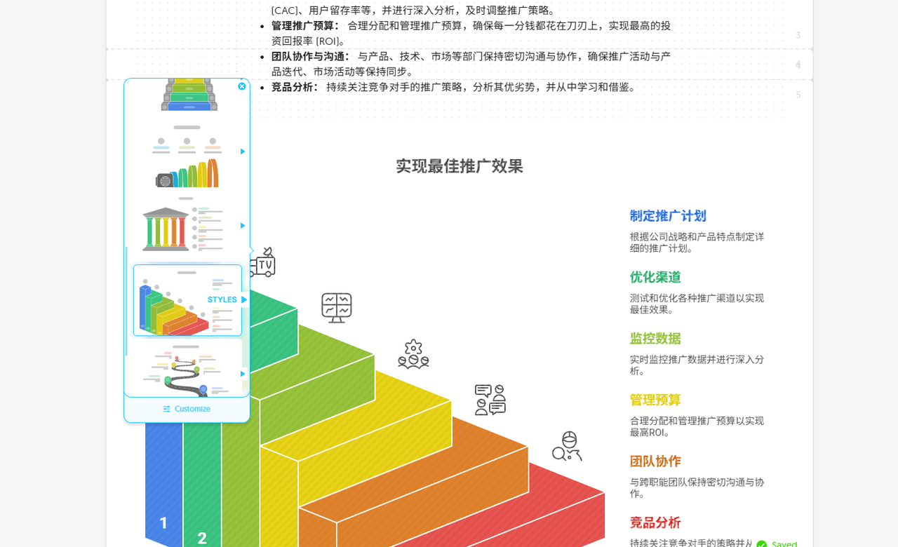
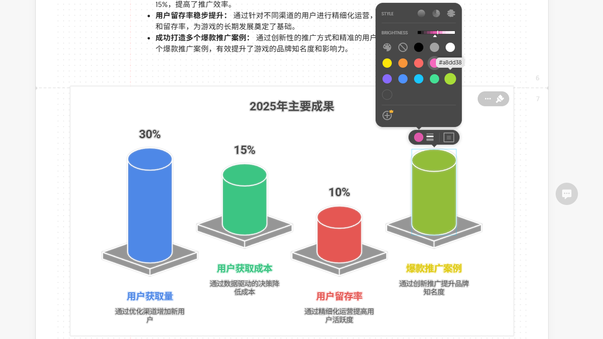
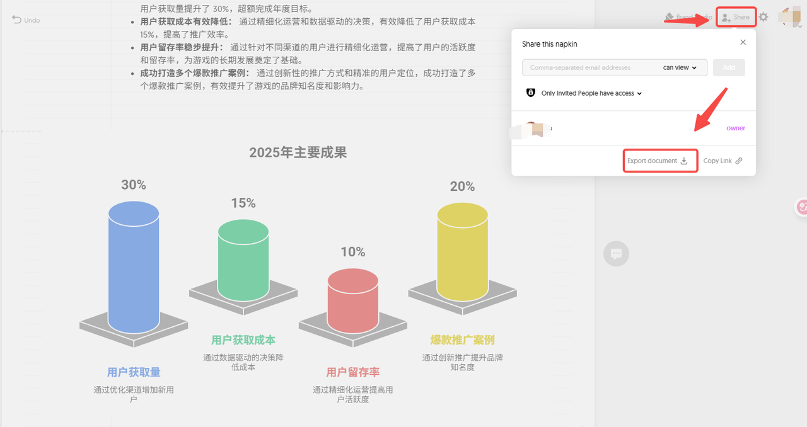

又到年底了，还在为做PPT熬夜肝到头秃？

或者被**Gamma**、**Canva**那些花里胡哨的付费功能卡脖子？

别急，今天给大家挖来了**3**个宝藏级AI工具——

**完全免费**，**不限次数**！

分分钟帮你搞定惊艳全场的PPT！

其中一款甚至能一键生成麦肯锡、波士顿咨询公司那种级别的专业图表！

话不多说，直接上干货！

***


### **&#x20;一、全能型选手：Z.ai&#x20;**


其实就是智谱清言，主打一个功能全面，操作简单，完全免费！

但相较于国内版，它的国际版**Z.ai**使用体验其实要更好一些。

主要是界面更简洁，图标指引啥的也更清晰。


#### **1.注册登录**

直接输入“**Z.ai**”进入官网，右上角找到登录按钮，用你的邮箱登录就行，30秒搞定！


#### **2.一句话生成PPT**

进入主界面后，找到 **AI PPT&#x20;**&#x5E76;点击。



直接输入你的需求，比如

```markdown
我是一个XX行业公司的XX岗位人员，主要负责XX工作，请帮我写一份2025年终述职总结
```

接下来就是见证奇迹的时刻！

你可以全程查看它的思考到创建PPT的过程：

从构建内容到后台写代码，一步步实时生成整个PPT，科技感拉满！




#### **3.在线编辑及导出PPT**

PPT生成后，你可以先预览，不满意的地方直接在线手动编辑。

当然你也可以继续输入需求，让ai帮你改。比如改成你们公司的品牌色调：

```markdown
我想将主色调换成科技蓝（#1A73E8）和灰白色（#F5F5F5）。
```



确认无误后，点击右上角的“**分享**”按钮，选择导出PPT格式就可以。

而且下载的是可编辑、无水印的PPT！




> **小诀窍：Z.ai**还能帮你一键翻新旧PPT！上传你做的PPT，用AI帮你美化升级，让老树开新花，想不到吧！


***


### **&#x20;二、图表之王：Napkin AI&#x20;**


如果你的PPT需要大量酷炫的数据图表，那**Napkin AI**就是你不二之选。

做出来的图表堪比顶级咨询公司！




#### **1.注册登录并选择模式**

注册登录后，有两个选项：

粘贴或上传你自己的文档内容，或者让AI帮你写。



#### **2.一键生成图表**

不管是上传文档还是选AI生成内容，生成之后再根据个人需求生成PPT图表：

你在文字左侧边栏会看到一个**闪电图标，**&#x76F4;接点击。

然后就能看到有超多根据你文字转变来的**专业级信息图表**！

对于有很多数据需要展示的文档，这个能让你的PPT上一个层级！

视觉效果直接对标麦肯锡、波士顿！





#### **3.在线编辑及导出PPT**

同样的，你还能随意调整和编辑。

比如更换图表颜色、编辑文字等，双击就能进行操作。



搞定后，点击右上角的“**Share**”，选择“**Export document**”就能导出。

支持导出**PPT、PDF、PNG、SVG等**格式。

真的超级方便！



***


### **&#x20;三、简洁高效派：kimi AI&#x20;**


**kimi AI** 应该很多人都很熟悉了，目前出来的效果也是杠杠的！

重点是同样免费无水印，生成速度也十分ok。

操作跟Z.ai大同小异，生成之后点击最后的文档，就能在线编辑或导出。


### **总结**

好了，这**3**款免费又强大的AI PPT神器就介绍到这了。

不管你是学生党、打工人还是创业者，用好它们，绝对能让你事半功倍，工作学习都更高效！

能白嫖的为啥要花钱？赶紧去试试吧，别再为PPT头秃了！


