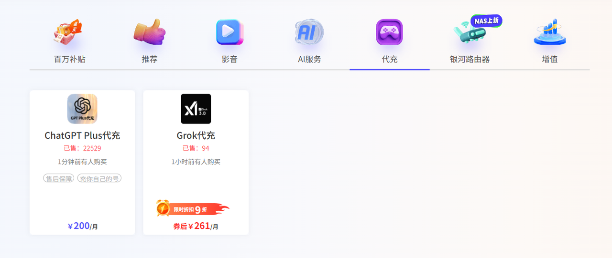
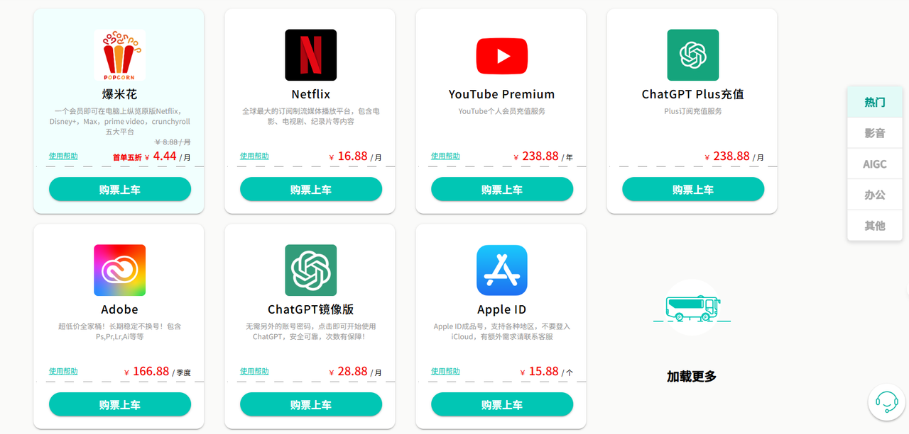
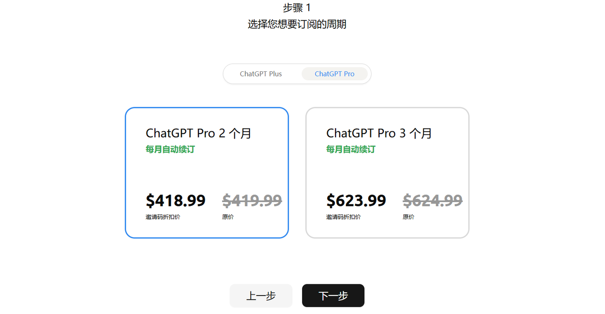
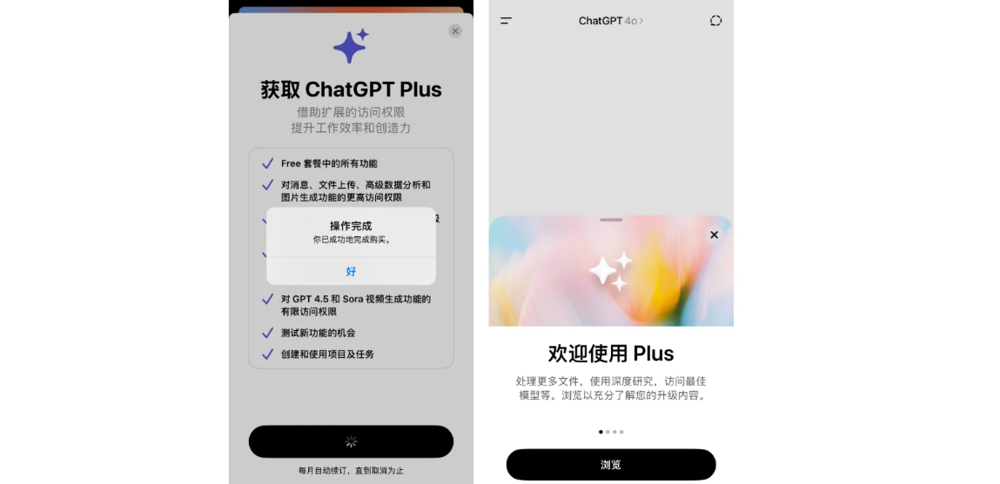
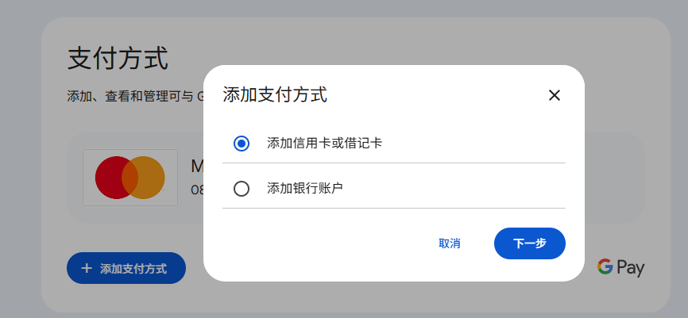

大家好，今天带来一份目前全面的ChatGPT Plus充值订阅和使用教程，涵盖多种方式，让你可以体验上ChatGPT Plus。

下面，让我们直接进入正题！

---

# 方法一：第三方充值

自从野卡失效后，代充成了目前最省心的订阅方式。然而，这个领域鱼龙混杂，选择时务必坚持两个原则：

* **避免“省小钱吃大亏”**：优先选择运营时间较长、具备国内备案信息的正规平台，安全性更有保障。

* **做好风险准备**：任何第三方服务都存在不确定性。建议按月或按季度短期订阅，需要时再续费，避免一次性投入过多。

以下是三个目前口碑较好的方式对比：

### **1.银河录像局**

该平台运营时间比较长了，且拥有备案信息。除了ChatGPT Plus，还提供**Netflix、Spotify、Claude**等多种海外流媒体和AI服务的订阅服务。

优势在于提供售后支持，但价格上每月约有8美刀的溢价。

传送门：[https://nf.video/37h7sn](https://nf.video/37h7sn)

### **2.环球巴士**

同样是运营时间较长的备案平台，服务范围还涵盖了ChatGPT Plus、Netflix、POE等。但价格溢价较高，每月约贵14美刀，并且不提供售后服务。

传送门：[https://universalbus.cn/?s=lTVZgwUD46](https://universalbus.cn/?s=lTVZgwUD46)

### **3.Wild AI**

原野卡团队提供的，好的点是价格相对实惠，每月溢价约3美刀，而且支持**ChatGPT&#x20;**&#xA;**Pro版**的订阅，有售后支持。

不过，他这个是要求两个月起充。

传送门：[https://bewild.ai?code=AGENT](https://bewild.ai?code=AGENT)

---

# 方法二：苹果礼品卡或Google Pay

### 1.苹果礼品卡

对于苹果用户来说，使用官方礼品卡是一种非常稳妥的方式。这种方法可以有效避免因购买第三方“黑卡”导致充值失败或账户被封的风险。

**具体步骤如下：**

1. **访问苹果官网**：进入礼品卡购买页面，选择通过左侧的“email”发送。

传送门：[https://www.apple.com/shop/buy-giftcard/giftcard](https://www.apple.com/shop/buy-giftcard/giftcard)

* **填写信息：**&#x4E0B;拉，然后选择或输入想要的金额（订阅ChatGPT Plus需至少20美刀），接着填写发送人和接收人的邮箱，这里可以填写同一个。最后按指引提交进入下一步。

* **支付**：在“check out”页面，可以选择以访客身份继续，接着就会跳转到绑卡页面。在绑卡页面，支付方式选择“Credit or Debit Card”，填入有银联支持的国内信用卡或借记卡信息完成支付就可以。亲测招商银行的信用卡成功。

* **兑换与订阅**：支付成功后，通常会在一小时内收到附有兑换代码的邮件。复制兑换代码，然后在App Store的个人账户页面中选择“兑换充值卡或代码”，即可将金额充值到你的美区Apple ID。之后打开ChatGPT应用即可完成订阅。

还没有美区Apple ID可以看这篇：

1

### 2.绑定Google Pay

如果你是安卓的话，可以尝试绑定Google Pay进行订阅，但也存在一定的失败几率。

**准备工作：**

* 一张国内发行的Visa或万事达卡。

* 一个稳定、干净的魔法。

* 一个Gmail账号。

**操作步骤如下：**

1. **访问谷歌钱包**：打开Google Wallet页面，选择“添加支付方式”。

传送门：[https://wallet.google.com/](https://wallet.google.com/)

* **绑定卡片**：选择添加信用卡或借记卡，然后将你的卡号信息填写进去。

* **填写地址**：另外地址栏需要填写一个美国地址，建议使用地址生成器创建一个免税州的地址（如俄勒冈州、特拉华州等）。

* **订阅**：成功绑定后，即可通过选择Google Pay完成订阅。

还不知道如何获取谷歌应用商店的可以看这篇：

1

---

# 方法三：国内直连使用

如果觉得以上所有方法都过于复杂，但又想用上GPT，那么国内直连镜像也是个不错的选择。

**优点：**

* 无需魔法，直接通过国内网络即可使用。

* 通常支持微信或支付宝支付，操作也便捷。

**缺点：**

* 价格相对官方订阅会更高一些。

* 服务质量和稳定性参差不齐。

在选择镜像时，还是记得遵循前文提到的两个原则：**选择运营时间长、有备案的平台**，并且**按月短周期购买**。

上文提到的银河录像局等平台也提供此类服务。

银河录像局：[https://nf.video/37h7sn](https://nf.video/37h7sn)

环球巴士：[https://universalbus.cn/?s=lTVZgwUD46](https://universalbus.cn/?s=lTVZgwUD46)

Wild AI：[https://bewild.ai?code=AGENT](https://bewild.ai?code=AGENT)

---

**总结一下**

* 想省事？用第三方充值。

* 想稳妥？用苹果礼品卡或Google pay。

* 还想更简单更直接？即开即用的国内直连镜像。

希望这能帮到大家，如果觉得内容有用，也可以顺手来个赞支持一下！
