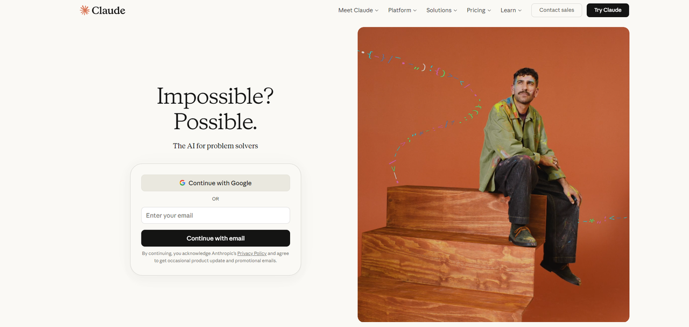
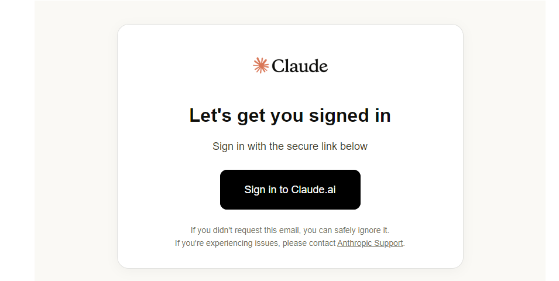
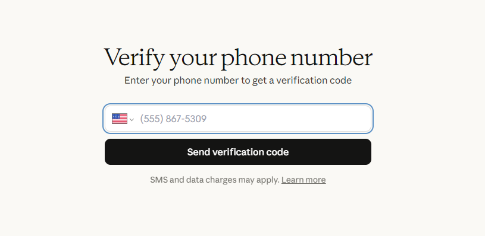
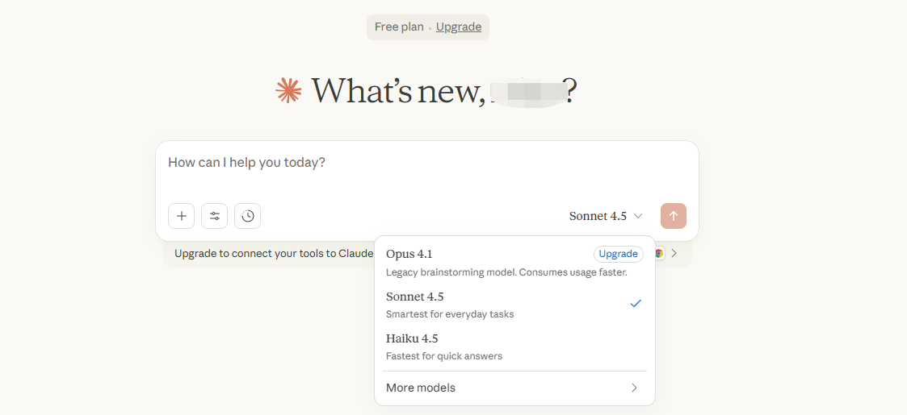
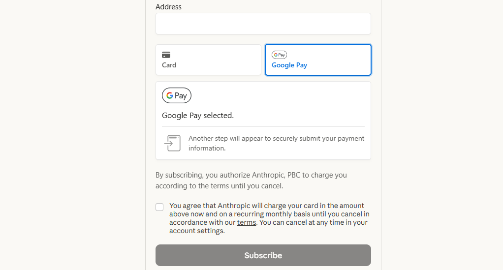
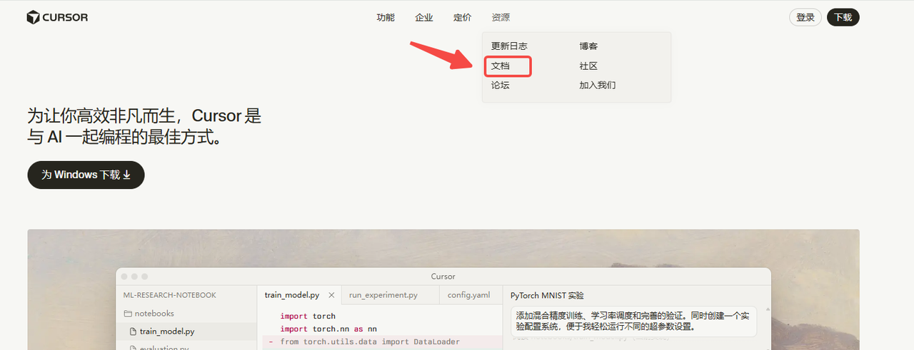
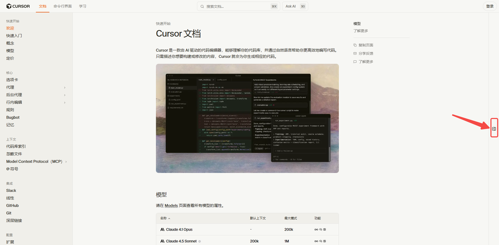
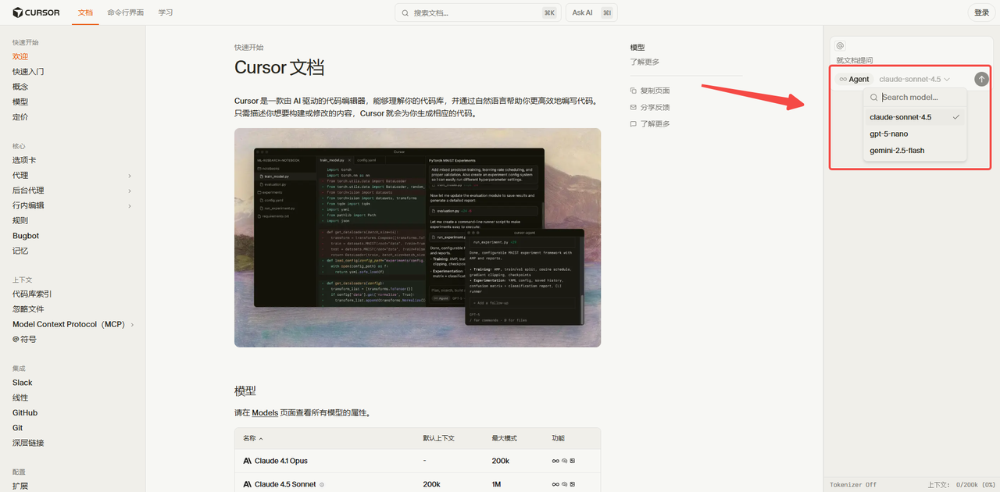

众所周知，Claude很好用，特别是用它来写代码和写文章，那绝对是独一档的体验。

然而也众所周知，虽然Claude很好用，但对国内用户十分不友好，天天封号。

但如果大家真的想要用，那也是有办法的，今天就来分享一下。

下面，让我们直接进入正题！

---

# 一、Claude如何注册使用

要想不被“露头秒”，需要先准备：

* 干净的魔法工具（可以通过[https://ping0.cc/](https://ping0.cc/)查一下，风控值越低越好）

* 海外邮箱：Gmail或者proton mail

* 海外手机号：可用接码平台

然后就可以开始了！

### 1. **进入官网**

打开Claude网站 [https://claude.ai/](https://claude.ai/)，输入你的邮箱后继续。

### 2. **邮件验证**

登录邮箱，找到Claude发送的验证邮件，点击其中的链接完成验证。

### 3. **手机号验证**

系统会要求输入手机号码进行验证。这里建议使用老美或英子的电话号码。

如果你没有海外手机号，可以使用接码平台获取（支持支付宝）。

在平台获取号码并完成验证后，你的Claude账号就注册成功了！

### 4. Claude Pro升级订阅

有海外卡的可以用海外卡解决，没有的可以尝试用Google pay或者苹果礼品卡。

具体操作可以看看这篇文章，大同小异：

[最新ChatGPT Plus国内升级订阅和使用方法盘点，超全！](https://toolmanai.com/posts/chatgpt-plus-shengji-jiaocheng/)

---

# 二、 国内直连镜像

这类服务是提供方将Claude的服务封装后在国内提供，无需“魔法”就能使用。

* **优点**：无需魔法，无需账号，国内网络直接使用；普遍支持微信/支付宝，获取简单；不用承担被封的风险。

* **缺点**：价格有溢价，服务稳定性和数据隐私性参差不齐。

所以选择的时候遵循以下原则：

* **避免“省小钱吃大亏”**：优先选择运营时间较长、服务稳定的平台，安全性更有保障。

* **做好风险准备**：任何第三方服务都存在不确定性。建议按月或按季度短期订阅，需要时再续费。

[2233](https://2233.ai/i/AGENT)算是一个比较稳定的选择，它甚至提供按天使用的套餐，适合尝鲜。

---

# 三、 其他第三方平台

除了直接使用Claude官网，许多优秀的工具和平台也集成了Claude的模型，你可以根据自己的需求选择。

1. **Cursor（可白嫖）**

Cursor是一个专为开发者设计的AI编程工具，集成了Claude，是写代码的神器。

但是！它是**国内网络可直接访问**，也支持支付宝/银联充值的。

重点是，可以白嫖Claude sonnet 4.5，无需登录！

**操作如下：**

* 打开[https://cursor.com/cn](https://cursor.com/cn)，在顶部选择“资源”>“文档”。

* 在跳转页面点击右侧的展开按钮。

* 然后在展开的对话栏选择Claude sonnet 4.5，就能直接使用。

不过测试了一下，对比官网原版体验上是有差距的，大家按需使用吧。

2. **OpenRouter**

最大的模型API集合站之一，可以在其聊天窗口免费体验Claude全系列模型，也提供API调用（重点是支持银联）。

3. **Poe**

全球知名的模型集合站，汇集了包括Claude、GPT、Gemini在内的顶尖模型。

希望这份攻略能帮助到每一位想使用Claude的朋友，如果觉得内容有用，也请点个赞支持支持！