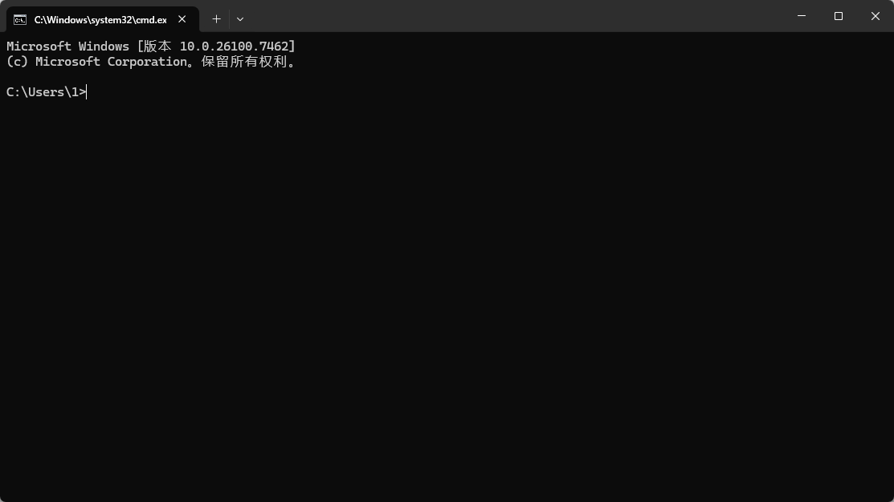
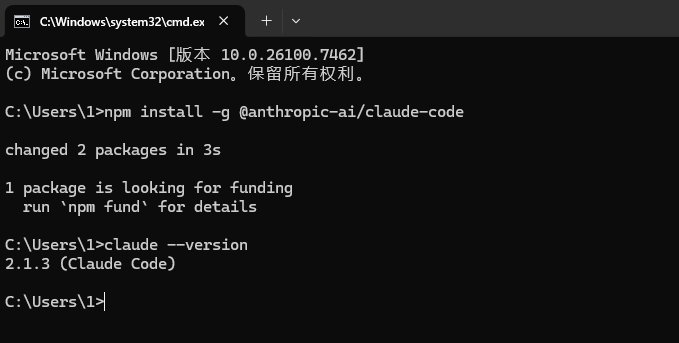
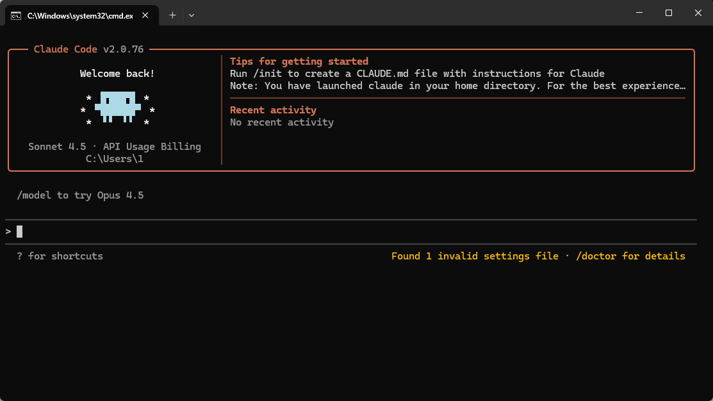
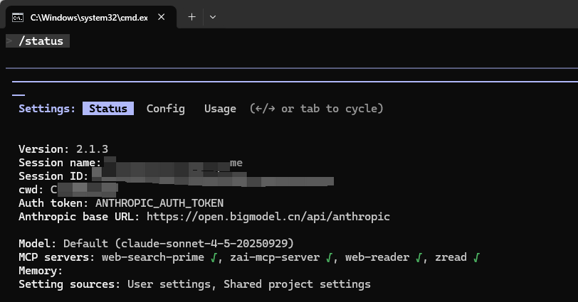
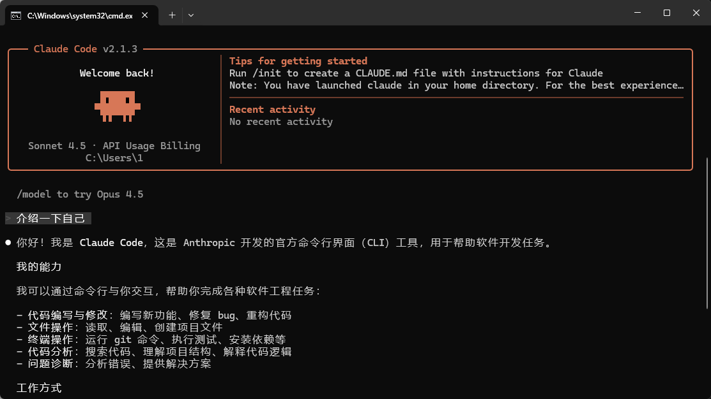
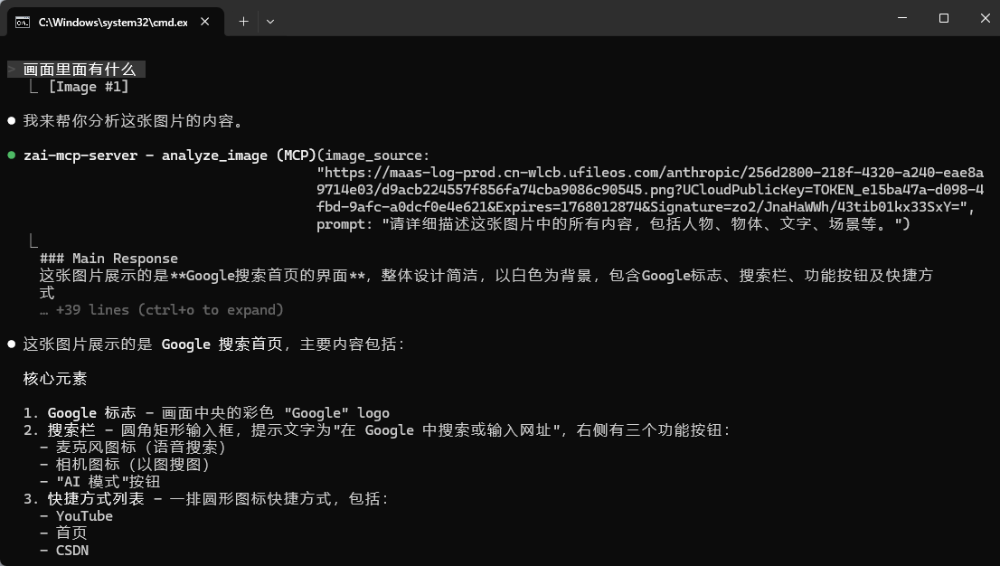

还在眼馋大佬们在黑窗口里敲两行代码就能搞定项目？

看着官方Claude封号严重、订阅太贵只能望洋兴叹？

别急！今天就手把手带你用国产模型丝滑替代，快速拿下这款当前最强 AI 编程神器 —— **Claude Code (CC)**！

而且Claude Code 2.1发布之后，一口气更新了80多个功能特性，又更强了！

话不多说，直接上干货！

***

# 一、 前期准备

1. 先准备好科学的网络环境。

2. 安装最新版本的 Node.js：https://nodejs.org/en/download/

3) WIndows用户还需要额外安装 Git for Windows：https://git-scm.com/install/windows

***


# 二、 核心步骤1：安装 Claude Code

然后咱们下面开始正式安装CC。

### 1.搜索并打开你电脑的终端工具。

* Windows：快捷键`Win+R`，输入`“cmd”`并回车。

* Mac：快捷键`“Command（⌘）+空格键”`打开搜索框，输入`“终端”`并回车。



### **2.输入命令**

在终端中，直接复制粘贴下面这行代码，然后按回车：

`npm install -g @anthropic-ai/claude-code`


### **3.验证是否安装成功**

等进度条走完，输入`claude --version`。

如果能正常返回版本号，则代表安装无误。



接着在终端输入 `claude`。

如果你看到了 Claude 的欢迎界面，恭喜你，咱们的第一步搞定了！



***


# 三、 核心步骤2：配置 API Key

众所周知，Claude的风控极其严苛，封号跟吃饭喝水一样，所以下面我们主要讲如何用国产模型实现平替。

> 如果是使用Claude原生API或者国外的API，则还需要配置代理，这里我们先跳过了，有需求的可以留言，我们后续补充。

国产模型中，像国内的智谱AI、Kimi 或 DeepSeek 都可以使用，其中智谱是能快捷配置的，对新手更友好。

具体如下：


### **1.获取密钥**

去智谱AI、Kimi 或 DeepSeek 官网申请 API Key。

```
智谱AI开放平台：https://www.bigmodel.cn/glm-coding?ic=IFWXL8ET6B
Kimi开放平台：https://platform.moonshot.cn/
DeepSeek开放平台：https://platform.deepseek.com/
```

> 使用API的时候是需要消耗token的，如果API没有额度，记得先充值。


### 2.配置Claude Code服务器

**① 快捷配置（智谱AI）**

如果你是用智谱AI，那在终端输入 `npx @z_ai/coding-helper`，就能打开这个页面。

通过键盘上下键和回车键进行操作选择。



然后按照中文提示粘贴API Key 即可一键导入配置。


**② 手动设置（其他国产模型）**

如果你用的是其他国产模型，也可以通过设置环境变量来接入，例如 Kimi：

在终端中进行配置（只对当前终端有效）：

* MacOS 和 Linux：

```bash
# Linux/macOS 启动高速版 kimi-k2-turbo-preview 模型
export ANTHROPIC_BASE_URL=https://api.moonshot.cn/anthropic
export ANTHROPIC_AUTH_TOKEN=${YOUR_MOONSHOT_API_KEY}
export ANTHROPIC_MODEL=kimi-k2-turbo-preview
export ANTHROPIC_SMALL_FAST_MODEL=kimi-k2-turbo-preview

# 启动claude
claude
```


* windows：

```shell
# Windows Powershell 启动高速版 kimi-k2-turbo-preview 模型
$env:ANTHROPIC_BASE_URL="https://api.moonshot.cn/anthropic";
$env:ANTHROPIC_AUTH_TOKEN="YOUR_MOONSHOT_API_KEY"
$env:ANTHROPIC_MODEL="kimi-k2-turbo-preview"
$env:ANTHROPIC_SMALL_FAST_MODEL="kimi-k2-turbo-preview"

# 启动claude
claude
```


### 3.确认配置是否生效

在Claude Code中输入`/status`确认模型状态。




### 4.后续启动与使用

到这里你已经拥有一个完整的Claude Code了！

后续使用，只需要在终端里，输入`claude`，然后回车，你就能看到下面的界面了。




***


# 四、 更多进阶技巧

既然装好了，怎么用最爽？关键来了！

### **1.文件夹即上下文**

建议新建一个专门的文件夹（比如“AI项目”），把要处理的文件拖进去，再输入`claude`启动，它就有了你的项目记忆。

### **2.粘贴图片**

遇到问题截图后，在终端用Mac使用快捷键 `Control + V`，Windows使用快捷键 `Alt + V`， 就能把图传给它看。


### **3.恢复与查看历史对话**

如果你中途退出，或者是由于某些原因将Cluade code强制关闭了，可以使用下面的命令恢复历史对话：

`claude -c `直接进入上次对话；

`claude -r `打开历史对话记录（使用较多）；


### 4.卸载Claude Code

在终端中输入卸载命令：

`npm uninstall -g @anthropic-ai/claude-code`


### 5.常用命令

```
/init：初始化项目，生成 `CLAUDE.md` 文件。这相当于给 AI 递了一份“项目说明书”。
/status：查看当前版本、模型、接口和代理状态。
/clear：发现 AI 聊“跑偏”了？直接清空历史，重新开始。
/compact：对话太长容易“溢出”失忆？用这个命令压缩上下文，保留重点。
/model：查看或切换当前使用的 AI 模型。
```


不得不说，Claude Code 的出现真的让小白也能体验到“指挥 AI 写代码”的快乐。

它不只是写代码的工具，它是一个真正的通用 Agent。

无论是几百行的表格处理，还是重新设计网页，也就是你一句话的事。

**总之万事开头难，最难的安装步骤你已经走完了。**

剩下的，就请尽情跟它聊天，寻找属于你的“Wow moment”吧！

有任何安装问题，咱们评论区见。

