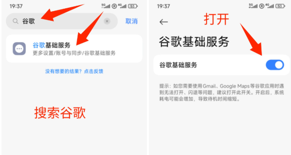
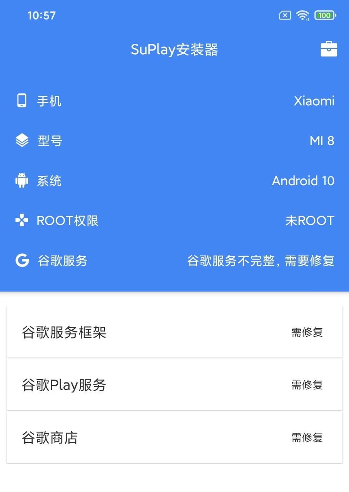
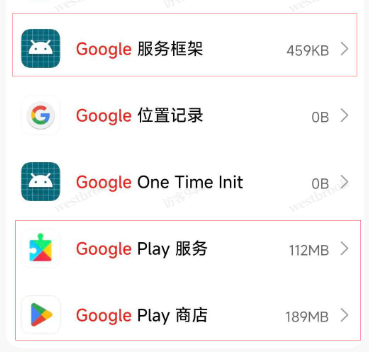
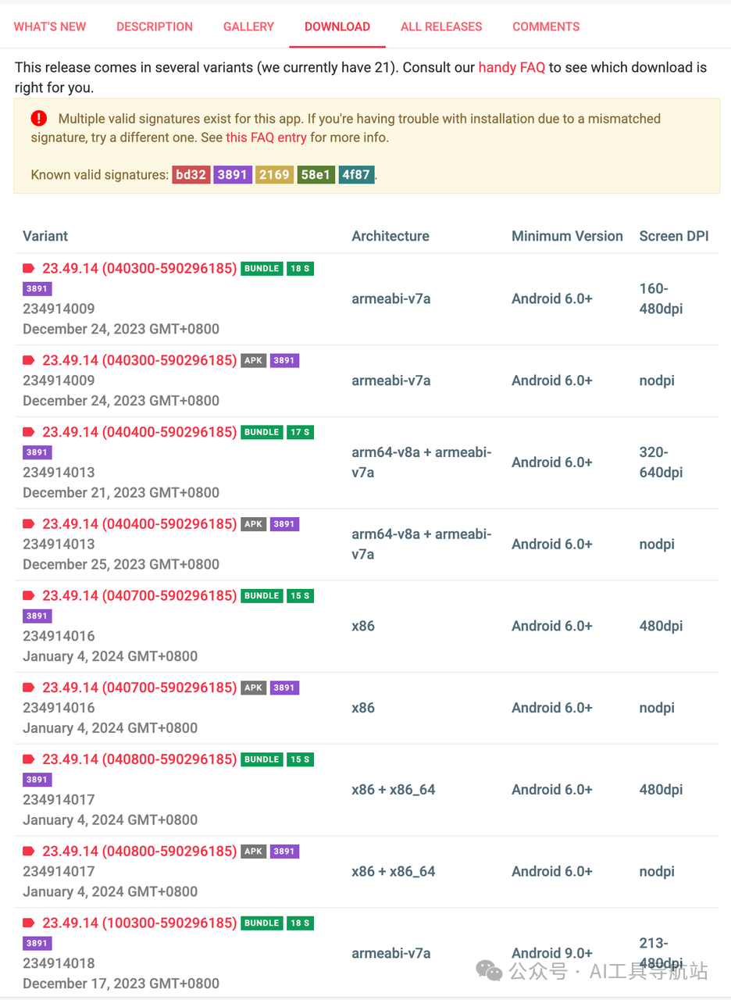

闲话少叙，今天来分享如何在安卓手机上下载谷歌应用商店，并下载海外软件。

**在开始前，需要注意可能出现的问题：**

> * 部分国产手机因系统架构问题，即使安装了Play商店也可能无法正常运作。
>
> * 低版本安卓系统可能无法支持谷歌服务，会出现应用闪退现象。
>
> * 有些品牌的手机是有下载好的Google服务框架和Google play服务，只需下载Google Play就行。

**准备工作**

> * 科学工具：大家自行准备，主要是下载。
>
> * 获取谷歌三件套：包含Google Play服务、服务框架及Google Play Store。
>
> * Gmail邮箱：建议注册美区的Google邮箱。

---

# 一、如何获取谷歌三件套

这一步共有三种方法：

### 1.手机自带（部分机型）

这种是最简单的。比如小米和红米的机型，直接打开设置，搜索谷歌，然后启用谷歌基础服务。

启用之前，前往应用商店，搜索`google play`，找到并安装就可以了。

如果你的手机没有原生支持，那就要往下看。

### 2.第三方应用一键安装

有很多第三方工具是支持能一键安装谷歌全家桶的，比如SuPlay安装器、Go安装器等，基本上是傻瓜式操作，点击就能一键安装。

如果手机装有应用宝或者豌豆荚，直接搜索就能下载对应这些第三方应用。

也可以通过这个传送门自取（含谷歌三件套）：

传送门1：[https://pan.quark.cn/s/7db6e76dc1e4](https://pan.quark.cn/s/7db6e76dc1e4)

传送门2:[https://pan.baidu.com/s/1RqV\_OhUuBBMfBoxZAMfslg?pwd=FLYP](https://pan.baidu.com/s/1RqV\_OhUuBBMfBoxZAMfslg?pwd=FLYP)

### 3.自行下载和安装

谷歌三件套一共包含Google服务框架（Google Services Framework）、Google Play服务（Google Play Services）、Google Play商店三个工具。

注意，需要先装前面两个，随后再装应用商店，要不然会打不开。

---

# 二、如何下载谷歌三件套

如果有科学工具，可以通过这个apkmirror来下载，版本很全。

传送门：[https://www.apkmirror.com](https://www.apkmirror.com)

打开链接后，找一个适合本机型的下载就行。

注意：通过手机的 设置 - 我的设备 - 全部参数 ，一般就能看到手机的安卓版本。

如果嫌麻烦，可以自取：

传送门1：[https://pan.quark.cn/s/7db6e76dc1e4](https://pan.quark.cn/s/7db6e76dc1e4)

传送门2:[https://pan.baidu.com/s/1RqV\_OhUuBBMfBoxZAMfslg?pwd=FLYP](https://pan.baidu.com/s/1RqV\_OhUuBBMfBoxZAMfslg?pwd=FLYP)

---

# 三、如何拥有Gmail账号

搞定了三件套后，打开Google Play直接登录就能开始使用。

但如果还没有的话，就需要获取一个，可以是自行注册，也可以是某鱼获取。

注册谷歌账户时需验证手机号，可以使用+86的手机号，如果收不到验证码，可以去专业的接码平台搞定。

传送门：[https://sms-activate.io/?ref=10913200](https://sms-activate.io/?ref=10913200)

需要注意，在年龄这块，要大于18岁。

然后按指引，就可以申请一个海外的Google邮箱，然后再用Google邮箱登录Google play，你就可以在商店中下载各类的海外软件了。

