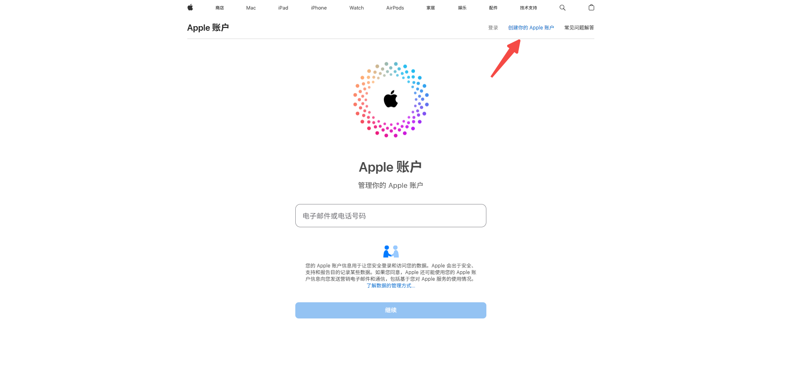
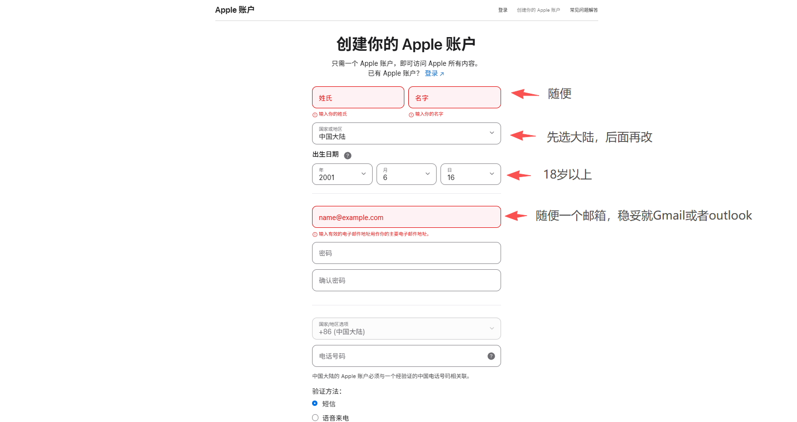
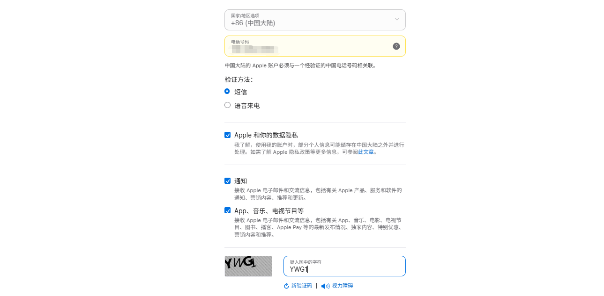
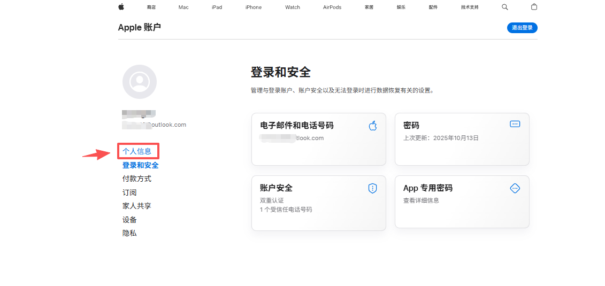
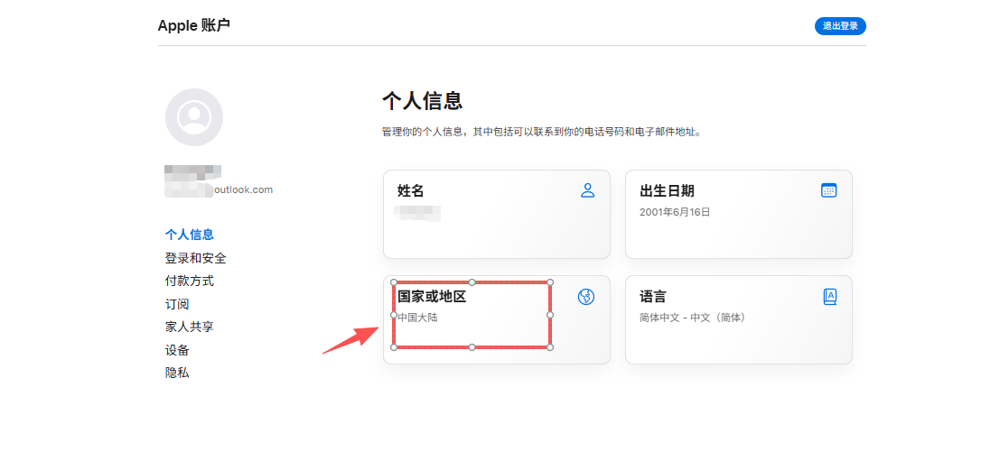
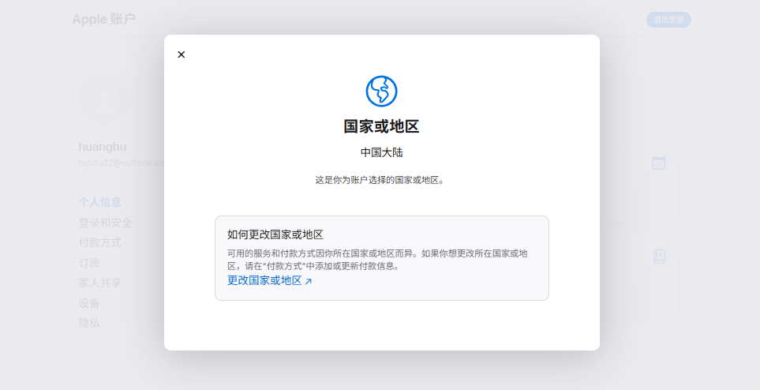
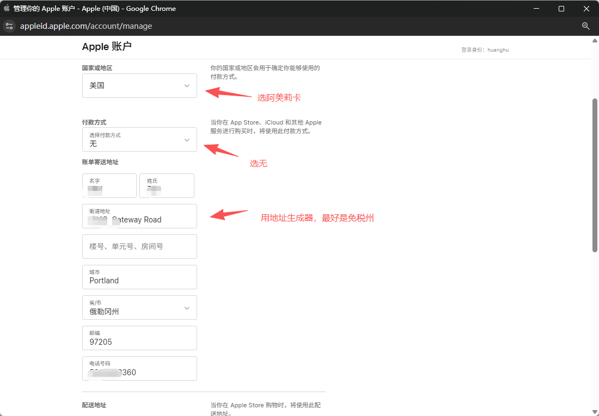
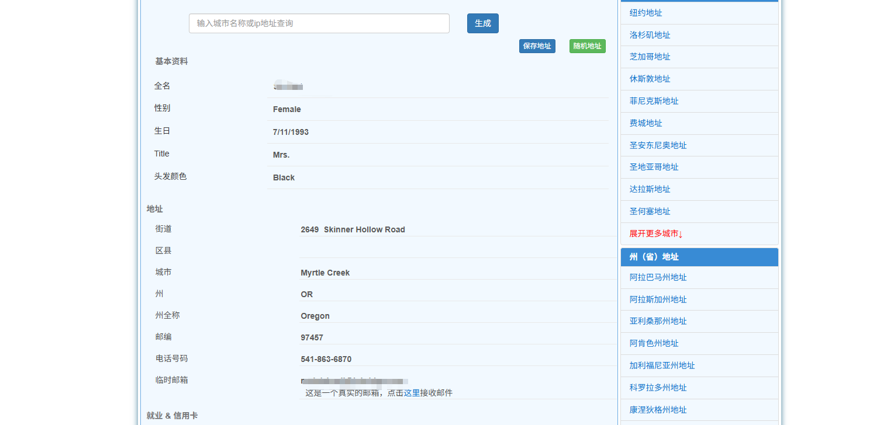
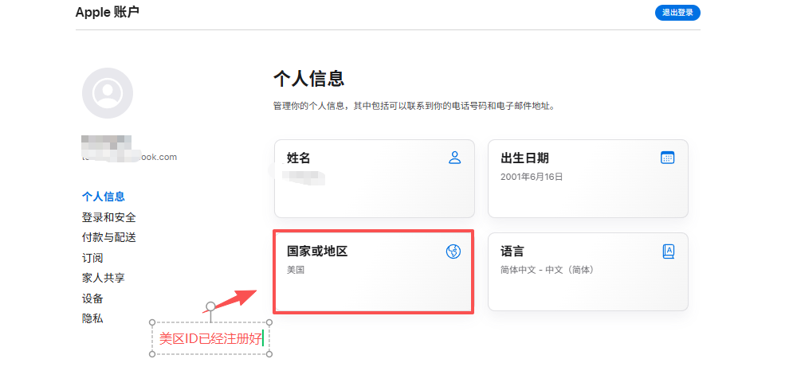

还在为不知道怎么注册美区苹果ID发愁吗？别急，今天手把手带你三分钟拿下美区Apple ID，从此开启一片新天地！

**准确点说，所有地区的Apple ID都能用此方法能注册。**

话不多说，直接上干货！

---

# 一、前期准备

在正式注册，咱们只需要准备两样东西：

* **一个海外邮箱：** 推荐使用Gmail或Outlook。既然要“出国”，当然要配上当地特色，这样能有效降低被风控的概率。

* **开启浏览器无痕模式：**&#x53EF;以避免很多不必要的麻烦。

---

# 二、登录苹果官网

**传送门：** [https://account.apple.com](https://account.apple.com/)

1. 打开页面，右上角点击“**创建你的Apple账户**”。

* **填写个人信息：**

  * **姓名：** 随便填，真实与否都行。

  * **国家或地区：** **注意！这里先选默认的“中国大陆”！**&#x6211;们后面再改。

  * **出生日期：** 务必设置成18岁以上。

  * **邮箱和密码：** 都可以，但推荐Gmail或Outlook邮箱，密码按照苹果的要求设置即可。

* **验证邮箱和手机：** 接下来，苹果会给你的邮箱和手机发送验证码，依次输入确认即可。到这一步，一个国区账号的“壳子”就准备好了！

---

# 三、更换到美区（或其他区）

1. 验证完后，会跳转到一个新页面。然后在左侧菜单栏找到“**个人信息**”，接着点击“**国家或地区**”。

* 选择“**更改国家或地区**”。

* 在国家列表中找到“**阿美莉卡**”并选择它，或者其他你想要的区（土区尼区啥的）。

* **填写地址：直接用地址生成器，照着填写就好。**&#x628A;生成器里的**街道、城市、邮编、电话**等信息，一一对应地粘贴到苹果的表单里。

**传送门：** [https://www.meiguodizhi.com/usa-address/oregon](https://www.meiguodizhi.com/usa-address/oregon)

* **重点：** 填完后，记得勾选“**拷贝账单地址**”这个选项！

* 最后，点击“**更新**”，看到成功提示后就大功告成了！

> **避坑小提示：** 如果在创建或更新过程中，提示“无法创建，请联系苹果客服”，别担心，这只是说明你的操作被风控了。换个网络环境或者稍等一段时间再试一般就能解决。

---

# 四、激活你的美区苹果ID

账号是创建好了，但还需要最后一步激活才能在App Store里愉快地玩耍。

1. 打开你的iPhone或iPad上的 **App Store**，先把之前登录的国区账号**退出**。

2. 然后，用你刚刚注册好的美区新账号进行登录。

3. **关键来了！** 随便找一个**免费的App**，点击下载。此时，系统会弹出一个提示框，要求你检查账户信息。这正是我们需要的！点击“**Review**”（检查）。

4. 接下来，系统会引导你同意条款，点击那个绿色的“**Agree to Terms and Conditions**”按钮，然后点“Next”。

5. 之后显示的个人信息页面，我们之前已经填好了，直接再次点击“**Next**”即可。

**搞定！**

看到App开始下载的那一刻，恭喜你，你的美区Apple ID已经满血激活，可以正式投入使用了！至于如何充值，可以看看之前这篇文章：

[最新ChatGPT Plus国内升级订阅和使用方法盘点，超全！](https://toolmanai.com/posts/chatgpt-plus-shengji-jiaocheng/)

