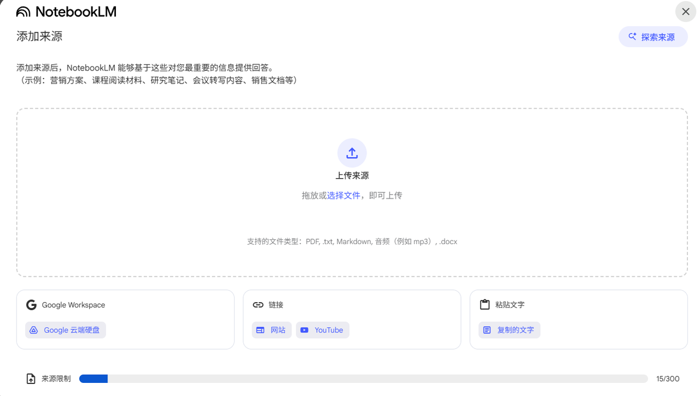
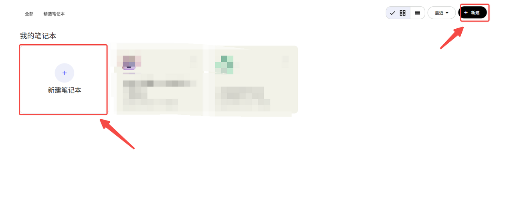
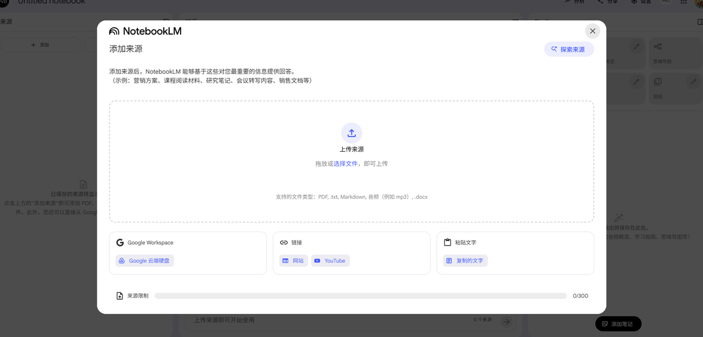
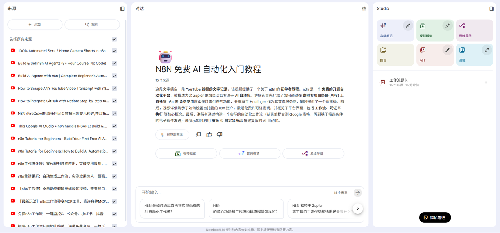
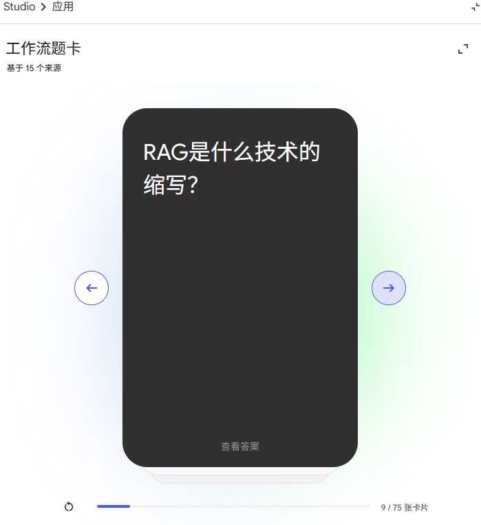
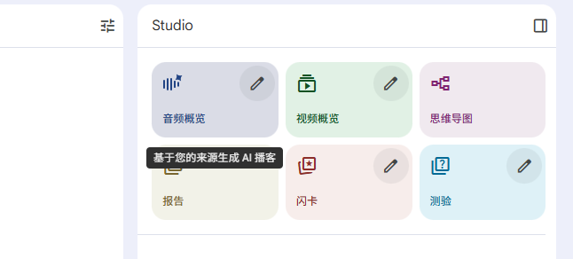
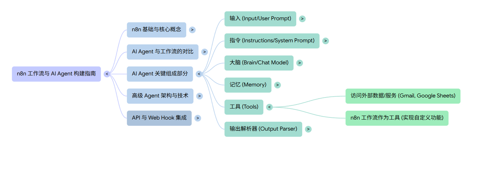

还在为开会时手忙脚乱的笔记发愁？

又或者面对堆积如山的考试资料，感觉脑子都快炸了？

别急！今天就手把手带你玩转一个谷歌出品的免费AI神器——**NotebookLM**！

它简直就是为处理海量信息而生的神器！无论是学生党还是上班族，相信用了都离不开！

而它采用的是RAG技术，用人话就是：

> **只根据你给的资料回答，绝不瞎编乱造！**

那话不多说，直接上干货！

***

# **三步上手，丝滑开启**

在开始之前，你需要准备几样小东西：

* **魔法**：你懂的，这是谷歌家的服务嘛。

* **一个谷歌账号**：用来登录和同步你的所有笔记。

* **你想整理的资料**：PDF、文档、网址、甚至是YouTube链接都行，它是你喂给AI的“口粮”！

准备好后我们开始！

### 1. **第一步：创建笔记**

直接在浏览器打开官网：
`https://notebooklm.google.com`

登录后，点&#x51FB;**“新建笔记”。**

### 2. **第二步：投喂资料**

在笔记的左侧栏，你会看到“**来源**”区域。

点击“添加”，把你准备好的文件全都丢进去即可。支持**PDF、Google文档、音频、文本文件**等，甚至网页链接、油管视频链接都能直接读取！

免费版最多支持50个来源，日常绝对够用！

### 3. **第三步：开始对话**

上传完毕，你会发现 NotebookLM 立即就帮你生成了所有资料的 **重点摘要**！

想不到吧！接下来，直接在下方的对话框里向它提问就行了。

***

# **NotebookLM 的8个神级用法**

### 1.**打造你的专属“AI家教”**

这是学生和老师的福音。

把所有课本、讲义、参考资料、甚至网课的视频链接全部上传。

然后，你可以让它：

> * **帮你总结重点**：比如，“帮我把‘模型差异’用表格对比出来”。
>
> * **生成“学习卡” (Flashcards)**：它会自动从你的资料里出题，帮你复习。
>
> * **生成“测验” (Quiz)**：直接生成小测验，答完还给分，告诉你错在哪。

### 2.**长文长视频一键总结**

看到四五十分钟的长视频或者上百页的PDF就头大？

直接把链接或文件丢给NotebookLM，它会瞬间告诉你核心内容，帮你决定这块“硬骨头”值不值得啃，节省大量时间！

### 3.**把你的笔记变成“私人播客”**

这个功能真的超方便！

如果你收集了一堆关于某个主题的文章和资料，但一直没时间看。

没关系，点&#x51FB;**“音频概览”** 。

它会把这个笔记里的所有重点，自动生成一个音频，像一集Podcast一样。

你可以还可以设置时长、语言。

然后，**你就可以在上下班开车、搭车、做家务的时候，用“听”的来学习**。

### 4.**上班族必备：会议录音秒变会议纪要**

开会时还在手忙脚乱地打字？你out啦！

你只需要打开手机版的NotebookLM（是的，它有App了），打开录音功能，然后**专心开会**。

会议结束，录音档自动上传，**它会立刻生成会议摘要**。谁说了什么、重点是什么、待办事项是什么，一清二楚。

你还可以把这次的录音和你之前的会议纪要（PDF）放在同一个笔记里，然后问它：

> “帮我对比一下，这次会议和上次会议在Q3目标上的差异。”

瞬间又变成了你的私人助理。

（当然，如果会议内容涉及高度机密，请不要上传云端。安全第一。）

### 5.**成为你的“思绪整理神器”**

当你需要做头脑风暴、市场分析、或者写论文时，这个功能就很棒。

你丢给它一个主题，比如“为什么Z世代这么注重健康养生？”，它会帮你**生成一个“思维导图”**。

你还可以不断点击分支，让它帮你无限延伸下去，激发你的新灵感。

### 6.**一键生成“教学短视频”**

这个功能简直是“降维打击”。

它可以把你笔记里的资料，**自动转换成一个带旁白、有画面的短视频**。

你甚至可以选择视频风格，比如“动漫风”。

这意味着什么？

**对于那些想做视频博主、又不想露脸的人来说，这简直是神器**。

你可以专注在内容研究，然后让AI帮你生成视频。

### 7.**打造你的第二大脑**

这是我个人认为最深刻的一个用法。

大多数AI工具，都是你问、它答。

但NotebookLM不一样。当你在研究资料时，你突然有了一个“灵光乍现”的想法。

这时，你可以**把你自己的想法，作为一个“新笔记”添加回这个笔记簿里**。

这个动作意义重大。**你不再是单向地索取，你是在和AI“共同创作”。**

你的灵感和AI整理的资料融合在了一起。这个笔记簿，就从一个“资料库”变成了一个真正有你灵魂的、高度浓缩的“**知识淬炼**”。

### 8.**万能的“报告生成器”**

最后，当你完成了所有的研究和思考，你需要一个“产出”。

它可以帮你把整个笔记的内容，**输出成各种形式的报告**。

比如：

> * 一份旅游规划
>
> * 一份竞品分析报告
>
> * 一份新员工培训手册
>
> * 一份产品操作说明书

而且，**它可以生成超过80种语言的报告**。

你的资料是中文的，但你可以让他直接输出一份日文版或英文版的报告给你的客户。

你还可以把整个笔记分享给你的同事，实现信息同步。

---

### **总结**

总而言之，NotebookLM 不只是一个笔记工具，它更像一个基于你自有资料的、绝对忠诚的AI研究助理。

它帮你深度消化、整理、再创造你拥有的信息。

最关键的是，这么强大的功能，它目前**免费**！

这羊毛，你确定不薅吗？

赶紧去试试吧，保证让你打开新世界的大门！

