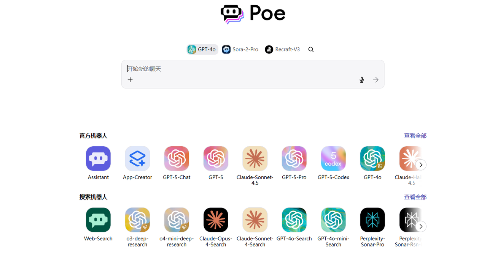
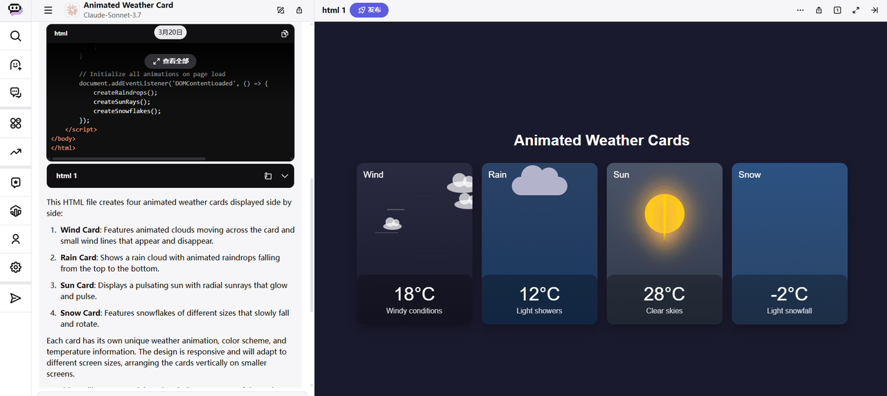
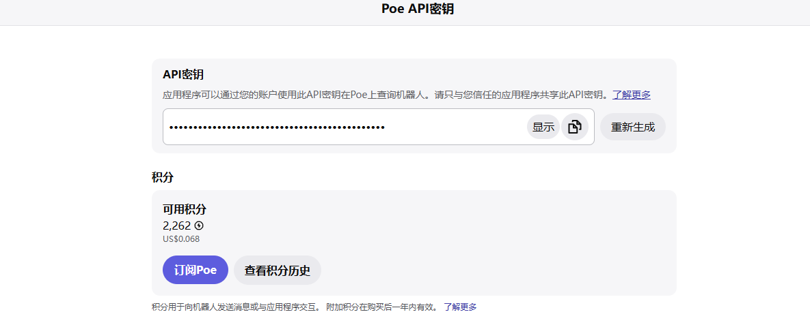
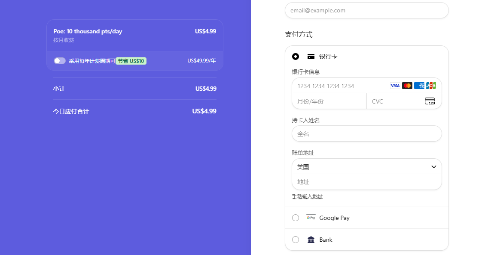
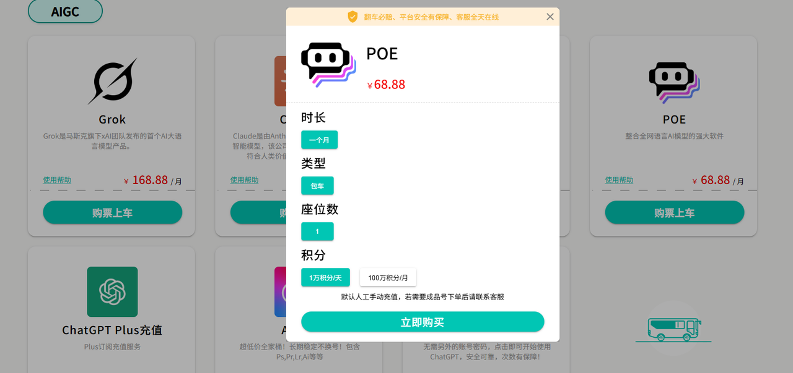

如果你遇到过：

> * 注册了Claude，结果撑不到一天就被封。
>
> * ChatGPT越用越傻，明显被降智。
>
> * Sora2没邀请进不去。

有一个很好的解决方法：

那就是去用Poe。

---

# 什么是Poe？

Poe，全称为“Platform of AI”，翻译过来就**“AI工具集合平台”**。

到这里已经不用过多解释了吧？

这是目前全球最大的人工智能模型聚合站。

它整合了众多顶尖AI模型，包括最新的语言模型如GPT-5、Claude 4.5 sonnet、Gemini 2.5Pro等。

此外，它还提供了Sora2、Veo3.1、可灵、海螺等热门视频生成模型，以及FLUX、GPT-4o、nano banana等先进的图像生成模型，为用户打造一站式的AI体验。

---

# 用Poe有哪些优势

相比单独订阅多个AI模型，Poe有着多方面的优势：

### 1. 一站体验全球顶尖AI，还能白嫖

只需注册一个Poe账号，便能使用全球各种风格、能力各异的AI模型。而且Poe还提供每日3000积分的免费额度，足以满足轻度用户的基本需求，极大地降低了使用门槛。

### 2.原生体验

像Claude的artifacts、ChatGPT和Gemini的canvas功能，都能直接用。

基本上能做到原生体验。

### 3. 封号风险低，也不担心降智

相比于ChatGPT降智，或Claude的封号困扰，Poe没有那么严苛的地区限制，因此账号被封的风险极低。

如果某个模型因某些特殊原因暂时无法使用，用户还可以切换使用其他模型，完全不受影响。

### 4.同样支持API调用

另外说一个可能很多人都不知道的事，Poe也是支持API调用的！

传送门：[https://poe.com/api_key](https://poe.com/api_key)

所以如果你暂时无法直接支付OpenAI API，或许这也是一个不错的绕过方式。

---

# 如何在国内订阅Poe？

Poe订阅界面显示支持银联，虽然通过概率比较低，但有双bi卡的朋友不妨试试。

此外想要在国内Poe，还有以下几种方式：

### 1. 通过第三方服务

最好选是有备案、运营时间久的，此外选择短期订阅、需要时再续费。

目前支持Poe的还是比较少，有需要也可以看一下：

传送门：[https://universalbus.cn/?s=lTVZgwUD46](https://universalbus.cn/?s=lTVZgwUD46)

### 2.苹果礼品卡或Google pay

首先，你需要搞定app的下载，具体可看：

* 【Apple】获取美区ID：

[最新美区Apple ID注册及充值保姆级教程，3分钟丝滑拿下！](https://toolmanai.com/posts/meiqu-appleid-jiaocheng/)

* 【安卓】获取Google play：

[最新安卓手机安装Google Play保姆级教程（含谷歌三件套下载）](https://toolmanai.com/posts/google-play-jiaocheng/)

然后通过苹果礼品卡或者Google pay去充值订阅，具体可看：

[最新ChatGPT Plus国内升级订阅和使用方法盘点，超全！](https://toolmanai.com/posts/chatgpt-plus-shengji-jiaocheng/)

Poe作为对国内用户比较友好的平台，作为大家体验一手全球顶尖AI是一个不错的选择，但如果你想要的是使用原版，也可以翻一下之前发过的其他教程。

希望对你有帮助！

