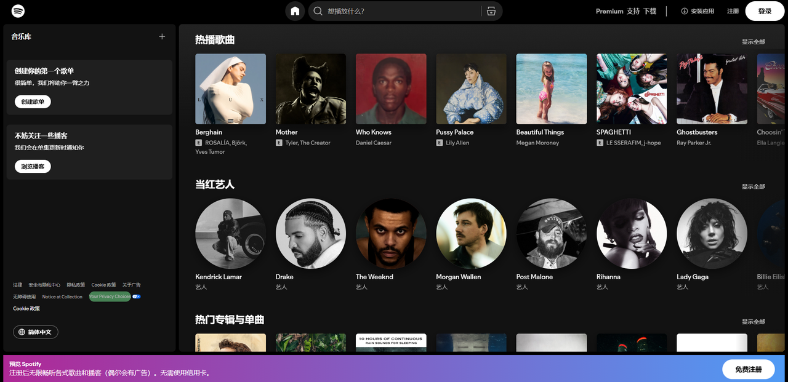
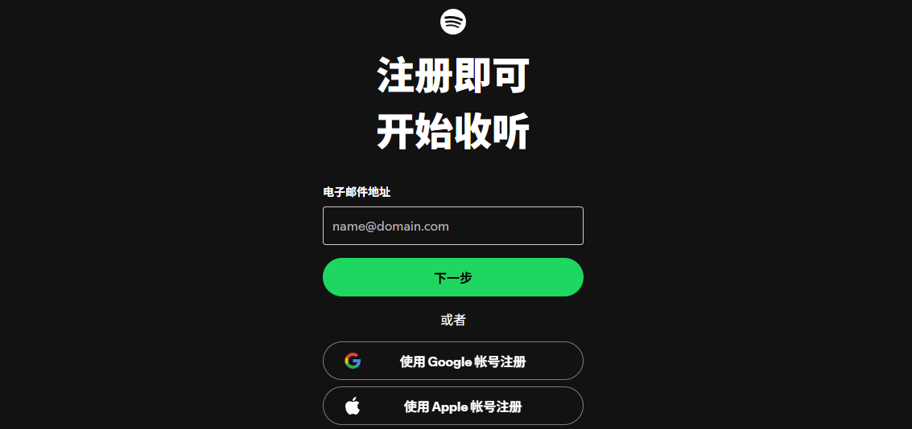
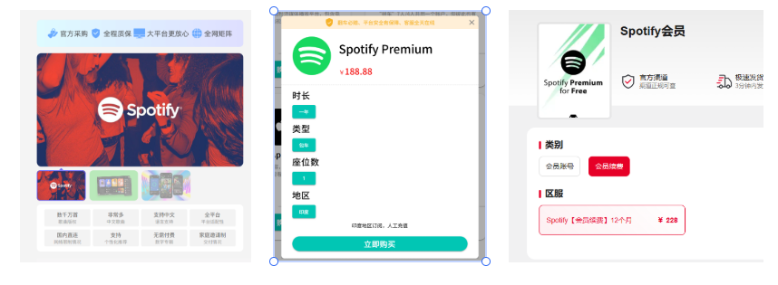

今天给大家分享一款在海外非常流行的音乐软件——

**Spotify**

可以说它不是什么小众软件，而是海外听歌的标配。

下面就来详细聊聊 Spotify 的注册、使用和会员获取方法：

---

# 如何注册Spotify？

### 1.进入 Spotify 官网

打开 Spotify 主页，点击下方或右上角的「注册」按钮。

### 2.输入邮箱注册

输入你的邮箱地址，按指引完成注册。

注册完成后,你就可以开始用 Spotify 了！过程非常简单。

---

# Spotify会员和免费的区别

Spotify作为一款正版流媒体音乐平台，2006年兴起于瑞典，目前：

* 覆盖全球超过 180 个国家和地区

* 活跃用户超过 6 亿

* 付费用户占比接近 50%

在使用上，免费版和会员版的区别:

* **免费版**：听歌时会插播广告，但核心功能都能用。

* 会员版：无广告，音质更好，还有离线下载等高级功能。

**划重点：只要你能忍受偶尔听听广告，Spotify 就是完全免费的。**

---

# 为什么很多人更喜欢用Spotify

### 1.纯粹的音乐体验，没有重复付费

在某Q和某云，即使你买了会员，很多新歌和热门专辑还是得单独买数字专辑！

相比之下，Spotify只要每月固定的会员费（合租后价格甚至比国内还低），所有歌曲基本都能听。

也没有各种直播、商城、社群等乱七八糟的东西，就是：

**听歌**。

### 2.曲库全面

Spotify的曲库覆盖欧美、日韩、甚至一些小众地区的音乐。

很多在国内平台找不到的冷门歌曲、国际专辑，在 Spotify上都有。

而且很多新专辑、新单曲通常第一时间就能听到。

### 3.推荐更合口味

自从用上Spotify后，我发现它的推荐算法完爆某云。

它会根据用户的听歌习惯推送个性化的音乐，让用户发现更多符合自己口味的音乐，最近就因为Spotify被安利了好多歌曲。

也可能单纯是曲库够大。

### 4.跨平台无缝切换

这个功能真的是“深得我心”——

Spotify支持在不同设备间无缝接力播放。

举个例子，我在外面用手机听歌，回到宿舍后，可以让电脑从当前播放位置继续播放。

此时手机变成为了遥控器，拖动进度条可以控制桌面端 Spotify 的播放进度，音量键也用来调整桌面端的音量。

---

# 国内如何订阅Spotify Premium

Spotify显示支持银联，虽然通过概率比较低，但有双bi卡的朋友可以试一下。

此外还有以下几种方式：

### 1. 通过第三方服务

因为这块选择会比较鱼龙混杂，大家选择的时候最好选是有备案、运营时间久的，此外选择短期订阅、需要时再续费。

供参考的传送门：

银河录像局：[https://nf.video/37h7sn](https://nf.video/37h7sn)

宇宙巴士：[https://universalbus.cn/?s=lTVZgwUD46](https://universalbus.cn/?s=lTVZgwUD46)

账号星球：[https://acceboyaibot.acceboy.com/](https://acceboyaibot.acceboy.com/)

### 2.苹果礼品卡或Google pay

首先，你需要搞定APP的下载，具体可看：

* 【Apple】获取美区ID：
[最新美区Apple ID注册及充值保姆级教程，3分钟丝滑拿下！](https://toolmanai.com/posts/meiqu-appleid-jiaocheng/)

* 【安卓】获取Google play：
[最新安卓手机安装Google Play保姆级教程（含谷歌三件套下载）](https://toolmanai.com/posts/google-play-jiaocheng/)

然后通过苹果礼品卡或者Google pay去充值订阅，具体可看：

[最新ChatGPT Plus国内升级订阅和使用方法盘点，超全！](https://toolmanai.com/posts/chatgpt-plus-shengji-jiaocheng/)

好了，今天的分享就到这里。希望对你有帮助!
