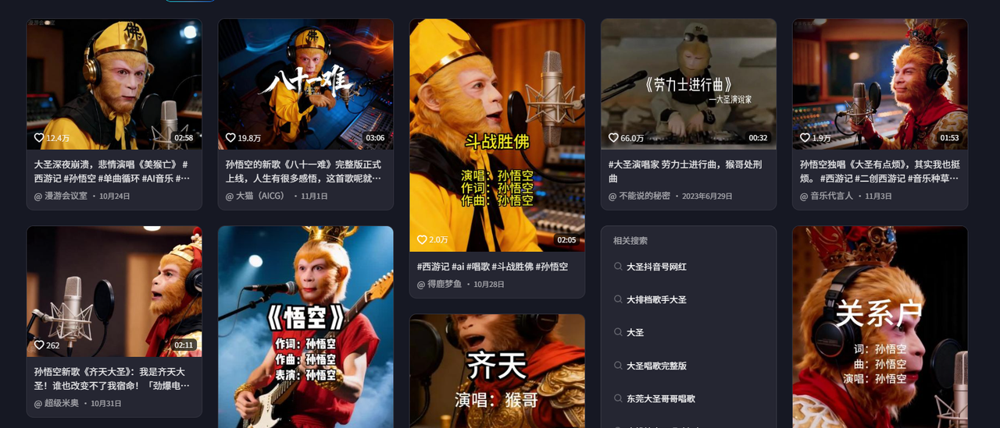
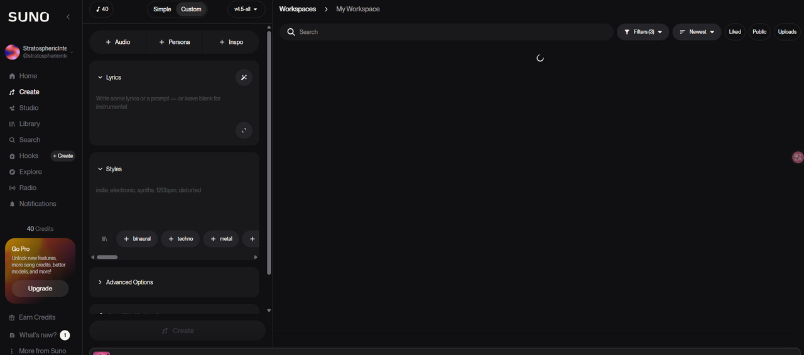
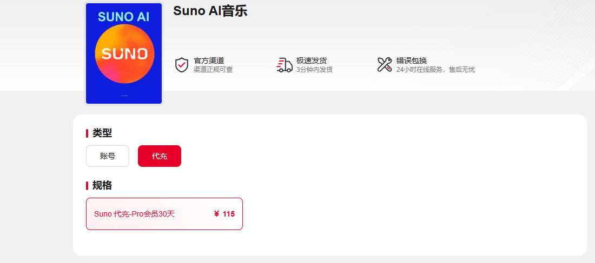
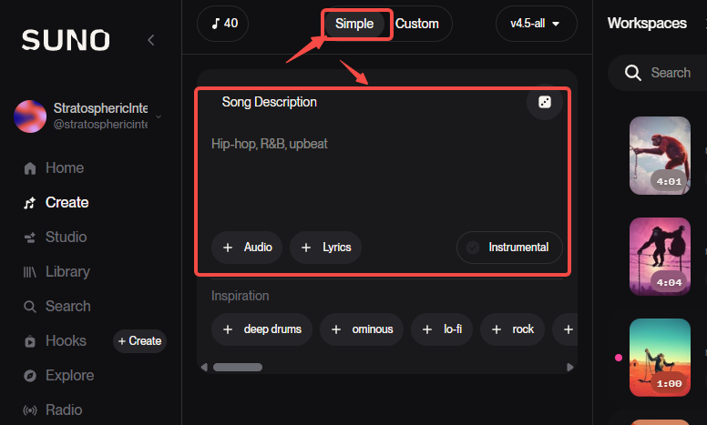
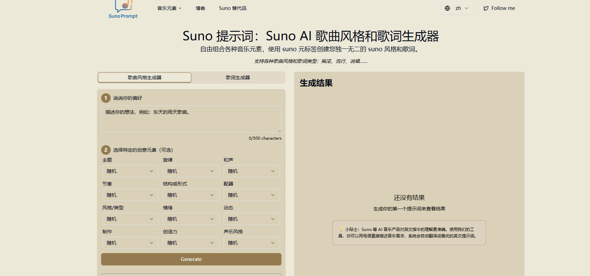
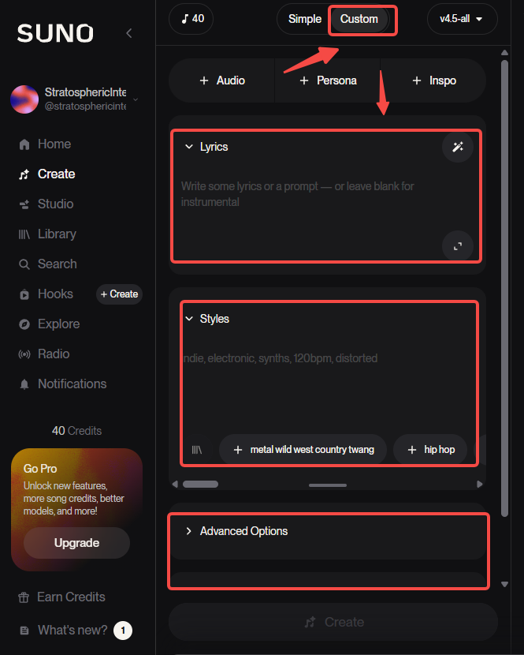
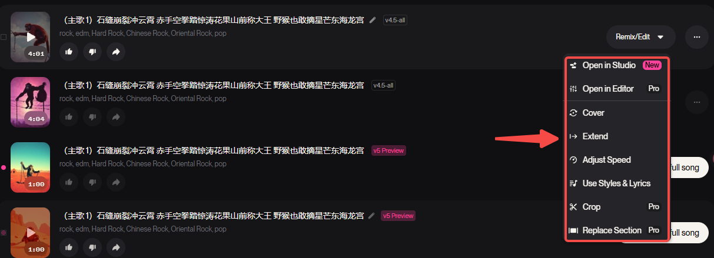

最近B站、抖音等大火西游人物唱歌你有没有刷到过？



这些歌其实一点难度都没有，30秒就能搞定！

没错，这些都是AI生成的！

而AI生成领域的top，非suno莫属。

话不多说，今天就手把手带你玩转Suno AI！

***


## <span style="color: rgb(36,91,219); background-color: inherit">一、国内怎么用Suno？</span>


开始之前，你需要准备这几样：

• **魔法工具**：懂的都懂

• 登录邮箱或者谷歌账号


然后：

* **进入suno.com** ，找到右上角"Sign in / Sign up"按钮 。

* 用你准备好的邮箱或谷歌账号注册并登录。

就这么简单！


***


## <span style="color: rgb(36,91,219); background-color: inherit">二、Suno如何充值订阅？</span>


先评估一下自己是否需要充值订阅：

免费用户每天有**50积分**，能生成**10首歌**，**自娱自乐完全够用**！

但是！**免费版生成的歌曲不能商用。**

想赚钱？想用在视频里？那就得考虑付费了。


目前Suno有两个版本的订阅计划：

**Pro版（10美元/月）**

* 每月**2500积分**（约500首歌）

* 作品可商用

* 功能全开

**Premier版（30美元/月）**

* 每月**10000积分**（约2000首歌）

* 作品可商用

* 批量创作必备


### 具体充值方法

Suno订阅界面显示支持银联/visa等，有双币卡的可以试试。

又或者：

1. **找第三方充值**

这种方式简单省心，但请根据个人需要选择。⬇️

**传送门：[http://acceboyaibot.acceboy.com/](http://acceboyaibot.acceboy.com/)**



2. **自行订阅**

你可以通过苹果礼品卡或者Google pay去充值订阅，具体可看：⬇️

[最新ChatGPT Plus国内升级订阅和使用方法盘点，超全！](https://toolmanai.com/posts/chatgpt-plus-shengji-jiaocheng/)

***


## <span style="color: rgb(36,91,219); background-color: inherit">三、Suno ai音乐创作教程</span>


不管你是音乐创作小白还是有乐理基础的大佬，都能轻松就上手Suno。

### 1.简单模式

**适合人群**：想快速出效果体验一下suno能力的

**操作方法**：

* 在输入框直接写你的想法

* 比如："写一首关于齐天大圣孙悟空的歌"

* 点击生成，等30秒


> **小技巧**：勾选"Instrumental"按钮，就能生成纯音乐（无歌词）


#### Suno提示词技巧1

为了获得更好的效果，可以在提示词中包含以下元素：

* **声音类型**：男声、女声、男歌唱家

* **语言选择**：中文普通话、粤语、英语

* **音乐风格**：KPOP、Lo-Fi、Hip-hop、电子乐

* **情感氛围**：欢快、忧郁、激昂、宁静

* **节奏速度**：快节奏、慢节奏

* **乐器元素**：钢琴、吉他、小提琴

**比如：**

```markdown
 创作一首流行中式摇滚，主题是齐天大圣不屈的一生，男声演唱，中文普通话歌词
```

#### Suno提示词技巧2

另外还有其他偷懒的方式，直接让AI帮你写，比如豆包：

```markdown
以孙悟空的经历为背景，以第一人称视角，写一些孙悟空的摇滚音乐suno提示词
```

或者用专门的提示词生成网站，一键生成专业提示词，如**sunoprompt.com/zh。**



***

### 2.自定义模式

**适合人群**：追求完美、想要精确控制的创作者

**进入方式**：点"Custom"换




这个模式有**3大核心模块**，咱们一个个拆解：


#### 模块1：自定义歌词

**四种生成方式任你选**：

1. **用现成的**：古诗、文章或电影台词（注意版权！）

2. **自己原创**

3. **让Suno随机生成**：点"Full Song"，输入主题或随机

4. **AI帮你写**：用豆包或DeepSeek代劳

**向AI要歌词的提示词模板**：

> 请帮我创作一首关于\[主题]的\[风格]歌曲的歌词。 要求：\[歌词长度、情感基调、语言风格等]
> 我正在写一首关于\[主题]的\[风格]歌曲，请帮我构思一段副歌歌词。 要求：\[歌词长度、情感基调、语言风格等]


#### 模块2：音乐风格设定

几个技巧：

* 用**英文**填写，效果更稳定

* 可以只写一种风格，也能混搭

* 喜欢某首歌的感觉？但不知道具体怎么描述，让AI帮你分析风格


#### 模块3：更多高级操作

* **排除风格**：明确告诉AI"不要这种风格"

* **上传音频**：把你哼的旋律上传，AI帮你完善

* **添加角色**：比如多人合唱，给每个声部分配角色

***


## <span style="color: rgb(36,91,219); background-color: inherit">四、进阶使用：让你的歌更专业</span>


生成歌曲只是第一步，接下来的操作才是拉开差距的关键！

### 1.编辑歌曲

点击已生成歌曲右侧的三个点，可以对歌曲进行再编辑操作，比如：

> 换歌名和封面、对歌曲进行剪辑、重新生成、扩展歌曲、下载分享等等。

如果你订阅了Premier版，甚至能使用它的“Studio”专业的音乐编辑功能。




### 2.高级玩法：元标签（Meta Tags）

元标签是写在歌词中的一些指令，可以理解为写在歌词里的提示词。

* 格式： 使用方括号\[]表示。

* 官方建议：元标签保持简单，三个左右效果最好。

* 示例： \[classical piano sad verse]

#### 【三大类元标签】

2.1结构类元标签：

> * \[Intro]：前奏部分
>
> * \[Verse]：主歌
>
> * \[Chorus]：副歌
>
> * \[Bridge]：桥段
>
> * \[Outro]：尾奏

等等。

**2.2乐器类元标签：**

* 谨慎使用，可能会限制Suno的创作创意。

**2.3唱法型元标签：**

* 用于增加人声修饰，丰富音乐的动态感。

* 使用圆括号()表示。

* 例如：(Ooh), (Yeah)

**实战示例**：

```
[Verse]
孤独的夜晚 (Ooh)
想起你的脸 (Yeah)
[Chorus]
我还爱着你
```

***


## <span style="color: rgb(36,91,219); background-color: inherit">五、如何用Suno创作音乐变现</span>


其实玩法多种多样，比如：

* **上传音乐平台：**

发布到网易云音乐、QQ音乐、酷狗等，靠播放量赚取分成，或积累粉丝做音乐博主。

* **结合视频创作：**

比如大火的西游记人物唱歌，在抖音或者视频号等渠道起号，然后带货。

* **定制服务：**

如果你是专业音乐创作者，那suno可以大大提升你的创作效率！


***

虽然国内也有了豆包、海螺等可以创作ai音乐的工具，但是只要你对比过两者，你就能感受到明显的差异，不信大家可以试试。

好了今天的分享就到这，觉得有用的话别忘收藏！


